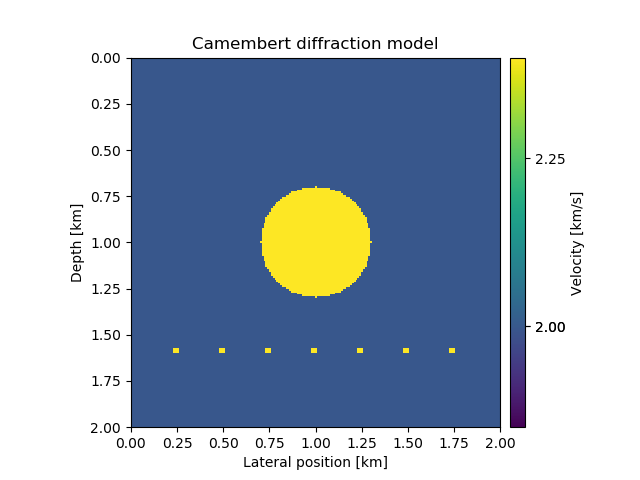
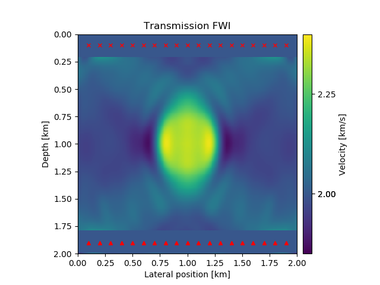
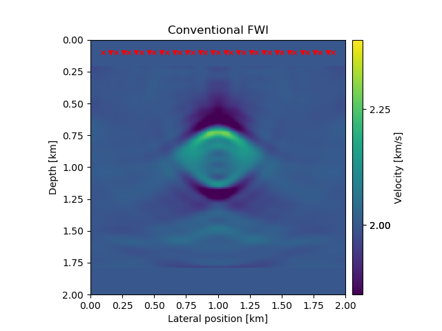
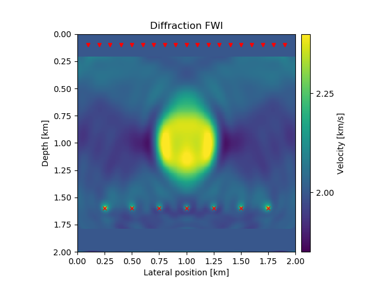

# Full-waveform inversion utiziling diffractions

### Simple FWI example with a phantom velocity model

Constant background model with circular velocity perturbation and several diffractors.

{width=80%} 

### Conventional FWI

Sources/receivers at the top.

{width=80%} 

### Transmission FWI

Sources at the top, receivers at the bottom.

{width=80%} 

### Diffraction FWI

Simplified diffraction FWI, where the diffractors act as sources.

{width=80%} 

